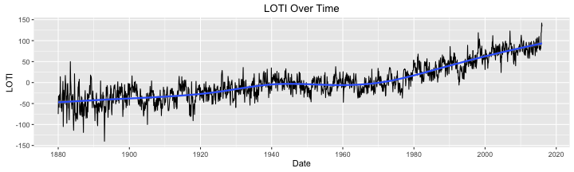
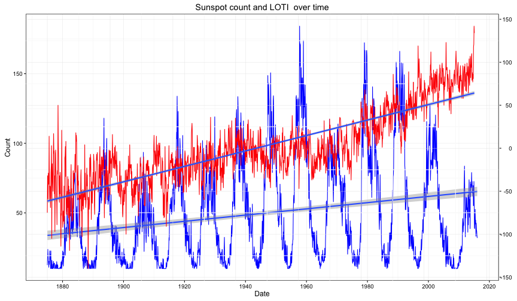

## Land-Ocean Temperature Index

To get the big picture of how temperature is behaving on earth with respect to time, 
scientists created the LOTI which averages the temperature over a grid on the surface of the 
earth and compare it to a logn term average of temperatures over the past years. The difference
between this two quantities is the LOTI.

LOTI is behaving has been growing for the last century, as show in the trend line.

---
## Comparison between Sunspots and LOTI

---
## Acknowledgements

Information from the following websites was used to create this presentation, I want to 
thank the people who have been working hard to collect and analize this data.

1. [Marshall Space Flight Center](http://solarscience.msfc.nasa.gov)
2. [Goddard Institute for Space Studies](http://data.giss.nasa.gov/gistemp/)
